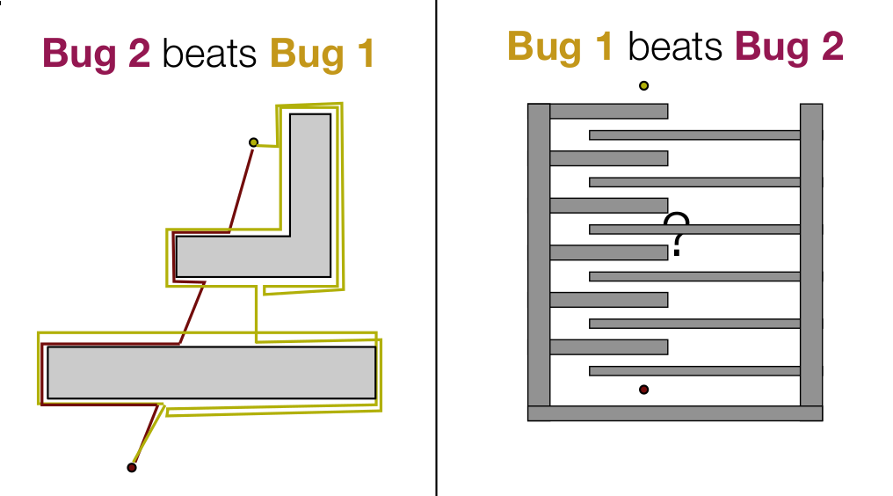

# Bug Algorithms

## Bug 1

Algorithm:  
1. head toward goal
2. if an obstacle is encountered, circumnavigate it and remember how close you
   get to the goal
3. return to that closest point (by wall-following) and continue

#### comments

* exhaustive search
* lower bound, $$D$$
* upper bound, $$D + 1.5 \sum_i P_i$$, where $$P_i$$ is the perimeter of
  the $$i^{th}$$ obstacle

## Bug 2

Algorithm:
1. head toward goal on the m-line
2. if an obstacle is in the way, follow it until you encounter the m-line again
   closer to the goal.
3. leave the obstacle and continue toward the goal

#### comments

* greedy search, tries to optimize by following $$m$$-line
* lower bound, $$D$$
* upper bound, $$D + 0.5 \sum_i n_i P_i$$, where $$P_i$$ is the perimeter of
  the $$i^{th}$$ obstacle and $$n_i$$ is the number of times the $$m$$-line
  intersects the obstacle
*

## Comparison

