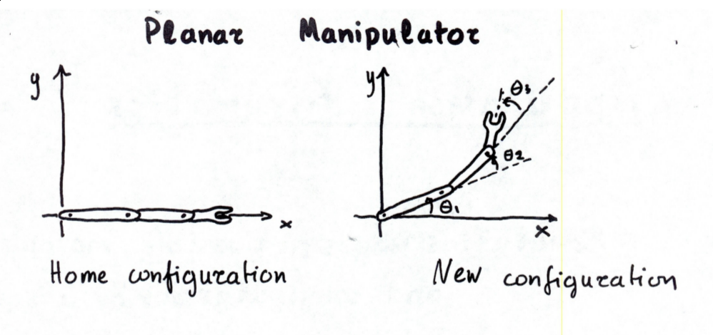

# Kinematics

Here we look at the relationship between the configuration and
workspaces of a system.  There are two types of kinematics we're
interested in:  
* forward kinematics: postion of end effector given configuration point
* inverse kinematics: configuration point given position of end effector


```python
import numpy as np
import matplotlib.pyplot as plt

%matplotlib widget
```


```python
plt.rcParams["figure.figsize"] = 10, 6
plt.rcParams["figure.dpi"] = 150
plt.rcParams["text.usetex"] = True
```


```python
from ipywidgets import interact, interactive, fixed, interact_manual
import ipywidgets as widgets
```


```python
def get_rotation_matrix(angle):
    rad = np.deg2rad(angle)
    return np.array([[np.cos(rad), -np.sin(rad)], [np.sin(rad), np.cos(rad)]])

def get_pivot_matrix(angle, pt):
    """
    Rotates {point} {angle} degrees around the point (x, 0).
    """
    
    rot = np.zeros((3, 3))
    rad = np.deg2rad(angle)
    
    rot_matrix = get_rotation_matrix(angle)
    rot[:2, :2] = rot_matrix
    rot[:2, 2] = -(rot_matrix @ pt) + pt
    
    return rot
```

## Planar Manipulator




```python
@interact(theta1=(0,45,5), theta2=(0,45,5), theta3=(0,45,5))
def plot_planar_manipulator(theta1=10, theta2=10, theta3=10):
    """
    Plots a 3 arm planar manipulator.
    """
    
    pt_color = "red"
    arm_color = "black"
    
    arms=[1, 1, 1] 
    points = [np.zeros(3)]
    for arm in range(1, 4):
        point = np.array([sum(arms[:arm]), 0 , 1])
        for angle, pivotx in list(zip([theta1, theta2 / 2, theta3 / 3], [0, sum(arms[1:2]), sum(arms[:2])]))[:arm]:
            point = get_pivot_matrix(angle, np.array([pivotx, 0])) @ point
        plt.scatter(point[0], point[1], c=pt_color)
        points.append(point)
        
    plt.xlim((0, 3))
    plt.ylim((0, 3))
    
    for pt in range(3):
        plt.plot([points[pt][0], points[(pt+1)][0]], [points[pt][1], points[(pt+1)][1]], c=arm_color)
```


    interactive(children=(IntSlider(value=10, description='theta1', max=45, step=5), IntSlider(value=10, descripti…

